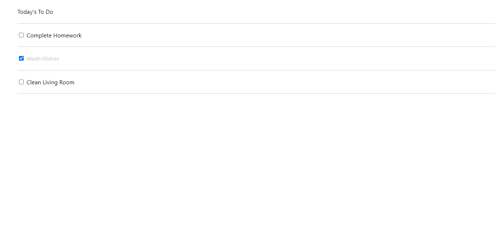

 

# JavaScript To-Do List - Review

This project is a JavaScript web application that acts as a to-do list which allows users to:

- Add new tasks to the list.
- Delete tasks from the list.
- Edit tasks on the list.
- Mark tasks as completed.
- Change the order in which tasks are listed.



## Built With

- HTML
- CSS
- JavaScript

## Live Demo

If you would like to see a live demo of this project, please click on the following [link](https://yuvrajm108.github.io/js-to-do-list/index.html).

## Getting Started

To get a local copy up and running follow these simple example steps:

### Install

You can download the code to your personal computer by cloning the repository using the following command:

```
git clone
```
### Usage

In order to run this project, enter the following command in your terminal:

```
npm start
```

## Author

👤 **Yuvraj Manoo**

-   GitHub: [@YuvrajM108](https://github.com/YuvrajM108)
-   LinkedIn: [Yuvraj Manoo](https://www.linkedin.com/in/yuvraj-manoo/)

## 🤝 Contributing

Contributions, issues, and feature requests are welcome!

Feel free to check the [issues page](https://github.com/YuvrajM108/js-to-do-list/issues).

## Show your support

Give a ⭐️ if you like this project!

## 📝 License

This project is [MIT](./LICENSE) licensed.